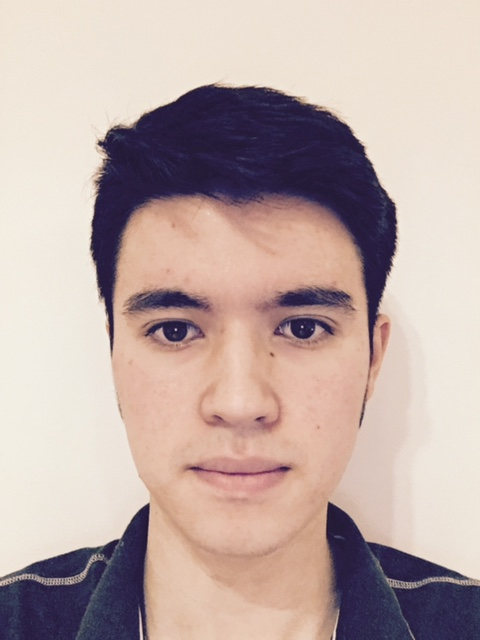

# About Us

We are a team based in the [School of Computing, National University of Singapore](http://www.comp.nus.edu.sg).

## Project Team

#### [William Sean Hawken](http://github.com/torasian)   
 

-----

#### [Vivian Low](http://github.com/sunset1215)
 

-----

#### [Gabe Ghe](http://github.com/GabrielGhe) 
 

-----

#### [Sean Zhang](http://github.com/puzzledsean)
 

# Contributors

We welcome contributions. See [Contact Us](ContactUs.md) page for more info.

* [Akshay Narayan](https://github.com/se-edu/addressbook-level4/pulls?q=is%3Apr+author%3Aokkhoy)
* [Sam Yong](https://github.com/se-edu/addressbook-level4/pulls?q=is%3Apr+author%3Amauris)

