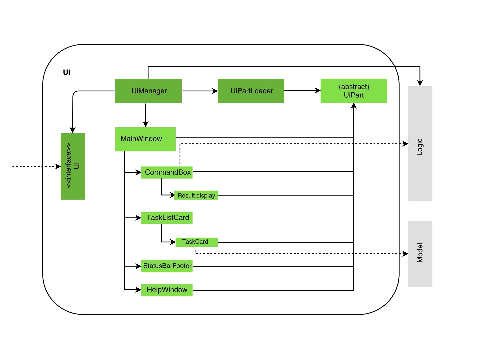
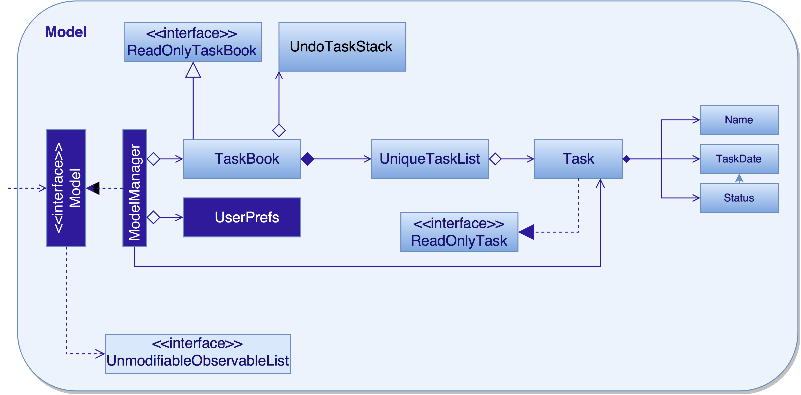

# Developer Guide 

* [Setting Up](#setting-up)
* [Design](#design)
* [Implementation](#implementation)
* [Testing](#testing)
* [Dev Ops](#dev-ops)
* [Appendix A: User Stories](#appendix-a--user-stories)
* [Appendix B: Use Cases](#appendix-b--use-cases)
* [Appendix C: Non Functional Requirements](#appendix-c--non-functional-requirements)
* [Appendix D: Glossary](#appendix-d--glossary)
* [Appendix E : Product Survey](#appendix-e--product-survey)

## Setting up

#### Prerequisites

1. **JDK `1.8.0_60`**  or later 

    > Having any Java 8 version is not enough.  
    This app will not work with earlier versions of Java 8.
    
2. **Eclipse** IDE
3. **e(fx)clipse** plugin for Eclipse (Do the steps 2 onwards given in
   [this page](http://www.eclipse.org/efxclipse/install.html#for-the-ambitious))
4. **Buildship Gradle Integration** plugin from the Eclipse Marketplace

#### Importing the project into Eclipse

0. Fork this repo, and clone the fork to your computer
1. Open Eclipse (Note: Ensure you have installed the **e(fx)clipse** and **buildship** plugins as given 
   in the prerequisites above)
2. Click `File` > `Import`
3. Click `Gradle` > `Gradle Project` > `Next` > `Next`
4. Click `Browse`, then locate the project's directory
5. Click `Finish`

  > * If you are asked whether to 'keep' or 'overwrite' config files, choose to 'keep'.
  > * Depending on your connection speed and server load, it can even take up to 30 minutes for the set up to finish
      (This is because Gradle downloads library files from servers during the project set up process)
  > * If Eclipse auto-changed any settings files during the import process, you can discard those changes.
  
#### Troubleshooting project setup

**Problem: Eclipse reports compile errors after new commits are pulled from Git**
* Reason: Eclipse fails to recognize new files that appeared due to the Git pull. 
* Solution: Refresh the project in Eclipse:  
  Right click on the project (in Eclipse package explorer), choose `Gradle` -> `Refresh Gradle Project`.
  
**Problem: Eclipse reports some required libraries missing**
* Reason: Required libraries may not have been downloaded during the project import. 
* Solution: [Run tests using Gradle](UsingGradle.md) once (to refresh the libraries).
 

## Design

### Architecture

 
The **_Architecture Diagram_** given above explains the high-level design of the App.
Given below is a quick overview of each component.

`Main` has only one class called [`MainApp`](../src/main/java/seedu/task/MainApp.java). It is responsible for,
* At app launch: Initializes the components in the correct sequence, and connect them up with each other.
* At shut down: Shuts down the components and invoke cleanup method where necessary.

[**`Commons`**](#common-classes) represents a collection of classes used by multiple other components.
Two of those classes play important roles at the architecture level.
* `EventsCentre` : This class (written using [Google's Event Bus library](https://github.com/google/guava/wiki/EventBusExplained))
  is used by components to communicate with other components using events (i.e. a form of _Event Driven_ design)
* `LogsCenter` : Used by many classes to write log messages to the App's log file.

The rest of the App consists four components.
* [**`UI`**](#ui-component) : The UI of tha App.
* [**`Logic`**](#logic-component) : The command executor.
* [**`Model`**](#model-component) : Holds the data of the App in-memory.
* [**`Storage`**](#storage-component) : Reads data from, and writes data to, the hard disk.

Each of the four components
* Defines its _API_ in an `interface` with the same name as the Component.
* Exposes its functionality using a `{Component Name}Manager` class.

For example, the `Logic` component (see the class diagram given below) defines it's API in the `Logic.java`
interface and exposes its functionality using the `LogicManager.java` class. 
 

The _Sequence Diagram_ below shows how the components interact for the scenario where the user issues the
command `delete 3`.

>Note how the `Model` simply raises a `TaskBookChangedEvent` when the SuperTasker data are changed,
 instead of asking the `Storage` to save the updates to the hard disk.

The diagram below shows how the `EventsCenter` reacts to that event, which eventually results in the updates
being saved to the hard disk and the status bar of the UI being updated to reflect the 'Last Updated' time.  

> Note how the event is propagated through the `EventsCenter` to the `Storage` and `UI` without `Model` having
  to be coupled to either of them. This is an example of how this Event Driven approach helps us reduce direct 
  coupling between components.

The sections below give more details of each component.

### UI component

 

**API** : [`Ui.java`](../src/main/java/seedu/task/ui/Ui.java)

The UI consists of a `MainWindow` that is made up of parts e.g.`CommandBox`, `ResultDisplay`, `TaskListPanel`,
`StatusBarFooter`, `BrowserPanel` etc. All these, including the `MainWindow`, inherit from the abstract `UiPart` class
and they can be loaded using the `UiPartLoader`.

The `UI` component uses JavaFx UI framework. The layout of these UI parts are defined in matching `.fxml` files
 that are in the `src/main/resources/view` folder. 
 For example, the layout of the [`MainWindow`](../src/main/java/seedu/task/ui/MainWindow.java) is specified in
 [`MainWindow.fxml`](../src/main/resources/view/MainWindow.fxml)

The `UI` component,
* Executes user commands using the `Logic` component.
* Binds itself to some data in the `Model` so that the UI can auto-update when data in the `Model` change.
* Responds to events raised from various parts of the App and updates the UI accordingly.

### Logic component

 

**API** : [`Logic.java`](../src/main/java/seedu/task/logic/Logic.java)

1. `Logic` uses the `Parser` class to parse the user command.
2. This results in a `Command` object which is executed by the `LogicManager`.
3. The command execution can affect the `Model` (e.g. adding a task) and/or raise events.
4. The result of the command execution is encapsulated as a `CommandResult` object which is passed back to the `Ui`.

Given below is the Sequence Diagram for interactions within the `Logic` component for the `execute("delete 1")`
 API call. 
 

### Model component

 

**API** : [`Model.java`](../src/main/java/seedu/task/model/Model.java)

The `Model`,
* stores a `UserPref` object that represents the user's preferences.
* stores the SuperTasker data.
* exposes a `UnmodifiableObservableList<ReadOnlyTask>` that can be 'observed' e.g. the UI can be bound to this list
  so that the UI automatically updates when the data in the list change.
* does not depend on any of the other three components.

### Storage component

 

**API** : [`Storage.java`](../src/main/java/seedu/task/storage/Storage.java)

The `Storage` component,
* can save `UserPref` objects in json format and read it back.
* can save the SuperTasker data in xml format and read it back.

### Common classes

Classes used by multiple components are in the `seedu.task.commons` package.

## Implementation

### Logging

We are using `java.util.logging` package for logging. The `LogsCenter` class is used to manage the logging levels
and logging destinations.

* The logging level can be controlled using the `logLevel` setting in the configuration file
  (See [Configuration](#configuration))
* The `Logger` for a class can be obtained using `LogsCenter.getLogger(Class)` which will log messages according to
  the specified logging level
* Currently log messages are output through: `Console` and to a `.log` file.

**Logging Levels**

* `SEVERE` : Critical problem detected which may possibly cause the termination of the application
* `WARNING` : Can continue, but with caution
* `INFO` : Information showing the noteworthy actions by the App
* `FINE` : Details that is not usually noteworthy but may be useful in debugging
  e.g. print the actual list instead of just its size

### Configuration

Certain properties of the application can be controlled (e.g App name, logging level) through the configuration file 
(default: `config.json`):

## Testing

Tests can be found in the `./src/test/java` folder.

**In Eclipse**:
* To run all tests, right-click on the `src/test/java` folder and choose
  `Run as` > `JUnit Test`
* To run a subset of tests, you can right-click on a test package, test class, or a test and choose
  to run as a JUnit test.

**Using Gradle**:
* See [UsingGradle.md](UsingGradle.md) for how to run tests using Gradle.

We have two types of tests:

1. **GUI Tests** - These are _System Tests_ that test the entire App by simulating user actions on the GUI. 
   These are in the `guitests` package.
  
2. **Non-GUI Tests** - These are tests not involving the GUI. They include,
   1. _Unit tests_ targeting the lowest level methods/classes.  
      e.g. `seedu.task.commons.UrlUtilTest`
   2. _Integration tests_ that are checking the integration of multiple code units 
     (those code units are assumed to be working). 
      e.g. `seedu.task.storage.StorageManagerTest`
   3. Hybrids of unit and integration tests. These test are checking multiple code units as well as 
      how the are connected together. 
      e.g. `seedu.task.logic.LogicManagerTest`
  
**Headless GUI Testing** :
Thanks to the [TestFX](https://github.com/TestFX/TestFX) library we use,
 our GUI tests can be run in the _headless_ mode. 
 In the headless mode, GUI tests do not show up on the screen.
 That means the developer can do other things on the Computer while the tests are running. 
 See [UsingGradle.md](UsingGradle.md#running-tests) to learn how to run tests in headless mode.
 
#### Troubleshooting tests
 **Problem: Tests fail because NullPointException when AssertionError is expected**
 * Reason: Assertions are not enabled for JUnit tests. 
   This can happen if you are not using a recent Eclipse version (i.e. _Neon_ or later)
 * Solution: Enable assertions in JUnit tests as described 
   [here](http://stackoverflow.com/questions/2522897/eclipse-junit-ea-vm-option).  
   Delete run configurations created when you ran tests earlier.
  
## Dev Ops

### Build Automation

See [UsingGradle.md](UsingGradle.md) to learn how to use Gradle for build automation.

### Continuous Integration

We use [Travis CI](https://travis-ci.org/) to perform _Continuous Integration_ on our projects.
See [UsingTravis.md](UsingTravis.md) for more details.

### Making a Release

Here are the steps to create a new release.
 
 1. Generate a JAR file [using Gradle](UsingGradle.md#creating-the-jar-file).
 2. Tag the repo with the version number. e.g. `v0.1`
 2. [Crete a new release using GitHub](https://help.github.com/articles/creating-releases/) 
    and upload the JAR file your created.
   
### Managing Dependencies

A project often depends on third-party libraries. For example, SuperTasker depends on the
[Jackson library](http://wiki.fasterxml.com/JacksonHome) for XML parsing. Managing these _dependencies_
can be automated using Gradle. For example, Gradle can download the dependencies automatically, which
is better than these alternatives. 
a. Include those libraries in the repo (this bloats the repo size) 
b. Require developers to download those libraries manually (this creates extra work for developers) 

## Appendix A : User Stories

Priorities: High (must have) - `* * *`, Medium (nice to have)  - `* *`,  Low (unlikely to have) - `*`

Priority | As a ... | I want to ... | So that I can...
-------- | :-------- | :--------- | :-----------
`* * *` | new user | see usage instructions | refer to instructions when I forget how to use the App
`* * *` | user | add a task by specifying a task description only | record tasks that needs to be done ‘some day’
`* * *` | user | add a task by specifying a task description and date | record tasks that needs to be done by the specified date
`* * *` | user | add a task by specifying a task description, start date and end date | record tasks that spans the specified dates
`* * *` | user | delete a task | get rid of tasks that I no longer care to track. 
`* * *` | user | edit a task | update the details of that specific task
`* * *` | user | search my tasks | find an item that I’m looking for in an easier manner
`* *` | user | list tasks | see what tasks I have to complete or have already completed
`* *` | user | undo the last command | go back to the previous state
`* *` | user | specify storage location | choose where to store the data
`* *` | user | mark tasks as complete | track tasks that have already been done
`* *` | user | use shorter versions of a command | type a command faster
`*` | user | tag my tasks based on priority | prioritize my goals
`*` | user | assign my tasks to a project or category | organize my tasks in an orderly manner
`*` | user | use common keyboard shortcuts | able to work more efficiently

{More to be added}

## Appendix B : Use Cases

(For all use cases below, the **System** is the `TaskManager` and the **Actor** is the `user`, unless specified otherwise)

#### Use case: Add task

**MSS**

1. User requests to add a task.
2. System notifies user that the task is added successfully and displays the newly added task. 
Use case ends.

**Extensions**

2a. Task already exists

> 2a1. System displays feedback that the task already exists.

2b. Invalid command format entered

> 2b1. System notifies user that the command entered is invalid and correct usage of the command.

#### Use case: Complete task

**MSS**

1. User requests to list tasks or find tasks.
2. System displays list of tasks.
3. User requests to set a task in the list as complete.
4. System notifies user that the task is set as complete successfully.
Use case ends.

**Extensions**

3a. Task was already set as complete.

> 3a1. System notifies user that the task was already set as complete.

3b. Specified task index is invalid

> 3b1. System notifies user that the task index provided is invalid.

#### Use case: Delete task

**MSS**

1. User requests to list tasks or find tasks.
2. System displays list of tasks.
3. User requests to delete a task in the list.
4. System notifies user that the task was deleted. 
Use case ends.

**Extensions**

3a. Task does not exist

> 3a1. System notifies user that the task was not found.

3b. Specified task index is invalid

> 3b1. System notifies user that the task index provided is invalid.

#### Use case: Find tasks

**MSS**

1. User requests to find a task.
2. System displays a list of tasks that match given keywords. 
Use case ends.

**Extensions**

1a. No match found

> 1a1. System displays an empty list.

#### Use case: Edit task

**MSS**

1. User requests to list tasks or find tasks.
2. System displays list of tasks.
3. User requests to edit a task in the list.
4. System updates the displayed list. 
Use case ends.

**Extensions**

3a. Task does not exist

> 3a1. System notifies user that the task was not found.

3b. Specified task index is invalid

> 3b1. System notifies user that the task index provided is invalid.

#### Use case: List tasks

**MSS**

1. User requests to list tasks due today.
2. System displays list of tasks due today. 
Use case ends.

1a. User requests to list all tasks.

> 1a1. System displays list of all tasks.

1b. User requests to list completed tasks.

> 1b1. System displays list of completed tasks.

1c. User requests to list pending tasks.

> 1c1. System displays list of pending tasks.

2a. No tasks found

> 2a1. System displays an empty list.

#### Use case: Undo previous commands

**MSS**

1. User requests to undo the previous command.
2. System notifies user that the command was undone. 
Use case ends.

**Extensions**

1a. There is no command to undo

> 1a1. The user is notified that there is no command to undo

#### Use case: Change storage location

**MSS**

1. User requests to change the storage location.
2. System notifies user that the storage location has been changed. 
Use case ends.

**Extensions**

1a. Storage location does not exist

> 1a1. System notifies user that the the storage location does not exist.

## Appendix C : Non Functional Requirements

1. Should work on any [mainstream OS](#mainstream-os) as long as it has Java `1.8.0_60` or higher installed.
2. Should be able to hold up to 1000 tasks.
3. Should come with automated unit tests and open source code.
4. Should favor DOS style commands over Unix-style commands. 
5. Should be able to retrieve a given event/deadline in 1s when searching. 
6. Commands such as edit, update, delete should not take longer than 1s to execute. 
7. The user interface should be simple to use and understand. 

## Appendix D : Glossary

#####  Floating Task 

> A task without any time constraints

#####  Event

> An event is a task with a start date/time and an end date/time

#####  Deadline

> A deadline is a time constraint that can be added to a task. It defines an end time/date than a task must be completed by.

##### Mainstream OS

> Windows, Linux, Unix, OS-X

## Appendix E : Product Survey

### Google Calendar

**Strength** 

1. Able to create subtasks for each task and write details for each task/subtask
2. Able to create multiple lists to group related tasks together
3. Has a calendar view that allows user to view events, deadlines and tasks by day, week or month

**Weakness** 

1. Only able to view one list at a time, unable to view all tasks at once
2. Task GUI is narrow and feels a bit cluttered when there are many tasks in the list

### Any.do

**Strengths** 

1. Simple UI for creating tasks -- simply swipe down to create a new task
2. Voice dictation for adding tasks
3. Swipe gestures for marking completed tasks
4. Allows users to add notes/subtasks to a reminder
5. Can share and assign tasks/reminders to different friends/emails
6. Group tasks by different lists

**Weaknesses** 

1. Simple UI does not allow setting of due date/time when creating tasks
2. Basic task like having repeating tasks is a premium service to pay for $2/month
3. Limiting location based reminders is also as a premium service to pay for $2/month

### Sunrise Calendar

**Strengths** 

1. Simple user interface
2. Connects to multiple existing apps such as google calendar and wunderlist
3. Easy to create a new event

**Weaknesses** 

1. Not very easy to search for events
2. Bought by Microsoft so now it costs money
3. Doesn’t have a way to attach email, pdf or images

### Wunderlist

**Strengths** 

1. Allows the use of multiple sub-tasks/events for each task/event.
2. Very easy to use
3. Can sort tasks alphabetically, by date created, priority etc.
4. Ability to share tasks with others

**Weaknesses** 

1. Subtasks are limited to 25
2. Cannot merge task lists together
3. UI is not customizable
