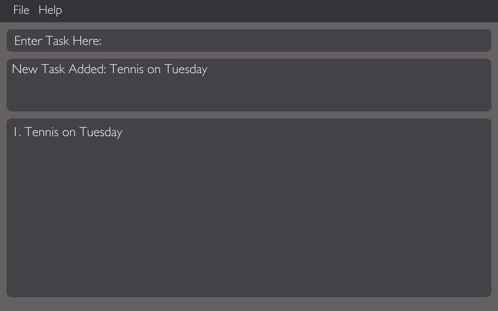

# User Guide

* [Quick Start](#quick-start)
* [Features](#features)
* [FAQ](#faq)
* [Command Summary](#command-summary)

## Quick Start

0. Ensure you have Java version `1.8.0_60` or later installed in your Computer. 
   > Having any Java 8 version is not enough.  
   This app will not work with earlier versions of Java 8.
   
1. Download the latest `supertasker.jar` from the [releases](../../../releases) tab.
2. Copy the file to the folder you want to use as the home folder for your Task Manager.
3. Double-click the file to start the app. The GUI should appear in a few seconds. 
   > 

4. Type the command in the command box and press <kbd>Enter</kbd> to execute it.  
   e.g. typing **`help`** and pressing <kbd>Enter</kbd> will open the help window. 
5. Some example commands you can try:
   * **`list`** : lists all tasks due today
   * **`add`**` do laundry` : 
     adds a task named `do laundry` to the Task Manager.
   * **`delete`**` 3` : deletes the 3rd task shown in the current list
   * **`exit`** : exits the app
6. Refer to the [Features](#features) section below for details of each command. 

## Features

> **Command Format**
> * Words in `UPPER_CASE` are the parameters.
> * Items in `SQUARE_BRACKETS` are optional.
> * Items with `...` after them can have multiple instances.
> * The order of parameters is fixed.

#### Viewing help : `help`
Format: `help`

> Help is also shown if you enter an incorrect command e.g. `abcd`
 
#### Adding a task: `add`
Adds a task to the task manager 
Format: `add TASK_NAME [sd/START_DATE] [st/START_TIME] [ed/END_DATE] [et/END_TIME] [tl/TIMELEFT]` 

> Task name is required, but providing start/end dates are optional.

Examples: 
* `add do laundry sd/6-10-2016`
* `add CS2103 project sd/1-10-2016 ed/14-11-2016`

#### Set a deadline to a task : `setdeadline`
Sets the amount of time left or an end date to the specified task from the task manager. 
Format: `setdeadline TASK_INDEX tl/TIMELEFT` or `setdeadline TASK_INDEX ed/END_DATE`

> Sets a deadline to the task at the specified `TASK_INDEX`. 
  The index refers to the index number shown in the most recent listing. 
  The index **must be a positive integer** 1, 2, 3, ...
  
Examples: 
* `list` 
  `setdeadline 2 tl/24` 
  Set a deadline with 24 hours left to the 2nd task in the task manager.
* `find CS2103`  
  `setdeadline 1 ed/23-10-2016` 
  Set a deadline on 23rd October 2016 to the 1st task in the results of the `find` command.

#### Set an event to a task : `setevent`
Sets an event to the specified task from the task manager. 
Format: `setevent TASK_INDEX EVENT_NAME [sd/START_DATE] [st/START_TIME] [ed/END_DATE] [et/END_TIME]`

> Sets an event to the task at the specified `TASK_INDEX`. 
  The index refers to the index number shown in the most recent listing. 
  The index **must be a positive integer** 1, 2, 3, ...

Examples: 
* `list` 
  `setevent 2 complete milestone 1 sd/1-10-2016 st/1400 ed/1-10-2016 et/1600` 
  Set an event on 1st October 2016 starting from 1400 - 1600 to the 2nd task in the task manager.
* `find CS2103`  
  `setevent 1 event roadshow sd/23-10-2016 ed/23-10-2016` 
  Set a full day event on 23rd October 2016 to the 1st task in the results of the `find` command.
  
#### Set task as completed : `setcomplete`
Sets an event to the specified task from the task manager. 
Format: `setcomplete TASK_INDEX`

> Sets the task at the specified `TASK_INDEX` as complete. 
  The index refers to the index number shown in the most recent listing. 
  The index **must be a positive integer** 1, 2, 3, ...
  
Examples: 
* `list` 
  `setcomplete 2` 
  Set the 2nd task as complete in the task manager.

#### Listing all tasks due today : `list`
Shows a list of all tasks due today in the task manager. 
Format: `list`

#### Listing all tasks : `listall`
Shows a list of all tasks in the task manager. 
Format: `listall`

#### Deleting a task : `delete`
Deletes the specified task from the task manager. 
Format: `delete TASK_INDEX`

> Deletes the task at the specified `TASK_INDEX`. 
  The index refers to the index number shown in the most recent listing. 
  The index **must be a positive integer** 1, 2, 3, ...

Examples: 
* `list` 
  `delete 2` 
  Deletes the 2nd task in the task manager.
* `find CS2103`  
  `delete 1` 
  Deletes the 1st task in the results of the `find` command.
  
#### Finding all tasks containing any keyword in their name: `find`
Finds tasks whose names contain any of the given keywords. 
Format: `find KEYWORD [MORE_KEYWORDS]`

> * The search is case sensitive. e.g `complete` will not match `Complete`
> * The order of the keywords does not matter. e.g. `write essay` will match `essay write`
> * Only the name is searched.
> * Only full words will be matched e.g. `assign` will not match `assignment`
> * Tasks matching at least one keyword will be returned (i.e. `OR` search).
    e.g. `write` will match `write essay`

Examples: 
* `find CS2103` 
  Returns `CS2103` but not `cs2103`
* `find assignment CS2103 CS2105` 
  Returns any task having names `assignment`, `CS2103`, or `CS2105`

#### Editing a task : `edit`
Edits the specified task from the task manager. 
Format: `edit TASK_INDEX [sd/START_DATE] [st/START_TIME] [ed/END_DATE] [et/END_TIME] [tl/TIMELEFT]`

> Edits the task at the specified `TASK_INDEX`. 
  The index refers to the index number shown in the most recent listing. 
  The index **must be a positive integer** 1, 2, 3, ...

Examples: 
* `list` 
  `edit 2 ed/23-10-2016` 
  Edits the end date of the 2nd task to 23rd October 2016 in the task manager.
  
#### Viewing a task : `view`
Views details of the specified task from the task manager. 
Format: `view TASK_INDEX`

> Views details of the task at the specified `TASK_INDEX`. 
  The index refers to the index number shown in the most recent listing. 
  The index **must be a positive integer** 1, 2, 3, ...

Examples: 
* `list` 
  `view 2` 
  Displays details of the 2nd task in the task manager.

#### Undoing the last command : `undo`
Undo the last command executed. 
Format: `undo` 

#### Clearing completed tasks : `undo`
Clears all completed tasks from the task manager. 
Format: `clear` 

#### Specifying data storage location : `store`
Specifies data storage location. 
Format: `store FILE_LOCATION`

> Stores data of the task manager at the specified `FILE_LOCATION`. 

Examples: 
* `store C:\Users\Vivian\Google Drive\NUS\Y2S1` 
  Specifies data storage location at 'C:\Users\Vivian\Google Drive\NUS\Y2S1'.

#### Exiting the program : `exit`
Exits the program. 
Format: `exit`  

#### Saving the data 
Address book data are saved in the hard disk automatically after any command that changes the data. 
There is no need to save manually.

## FAQ
       
## Command Summary

Command | Format | Description 
----------- | ------------------------------- | :--------- 
Help | `help` | View help on command usage
Add | `add TASK_NAME [sd/START_DATE] [st/START_TIME] [ed/END_DATE] [et/END_TIME] [tl/TIMELEFT]` | Add a task
SetDeadline | `setdeadline TASK_INDEX tl/TIMELEFT` or `setdeadline TASK_INDEX ed/END_DATE`| Set a deadline
SetEvent | `setevent TASK_INDEX EVENT_NAME [sd/START_DATE] [st/START_TIME] [ed/END_DATE] [et/END_TIME]` | Set an event
SetComplete | `setcomplete TASK_INDEX` | Set task as complete
List | `list` | List tasks due today
ListAll | `listall` | List all tasks
Delete | `delete TASK_INDEX` | Delete a task
Find | `find KEYWORD [MORE_KEYWORDS]` | Find all tasks containing any keywords
Edit | `edit TASK_INDEX [sd/START_DATE] [st/START_TIME] [ed/END_DATE] [et/END_TIME] [tl/TIMELEFT]` | Edit a task
View | `view TASK_INDEX` | View details of a task
Undo | `undo` | Undo last command
Clear | `clear` | Clear completed tasks
Store | `store FILE_LOCATION` | Specify storage location
Exit | `exit` | Exit program
