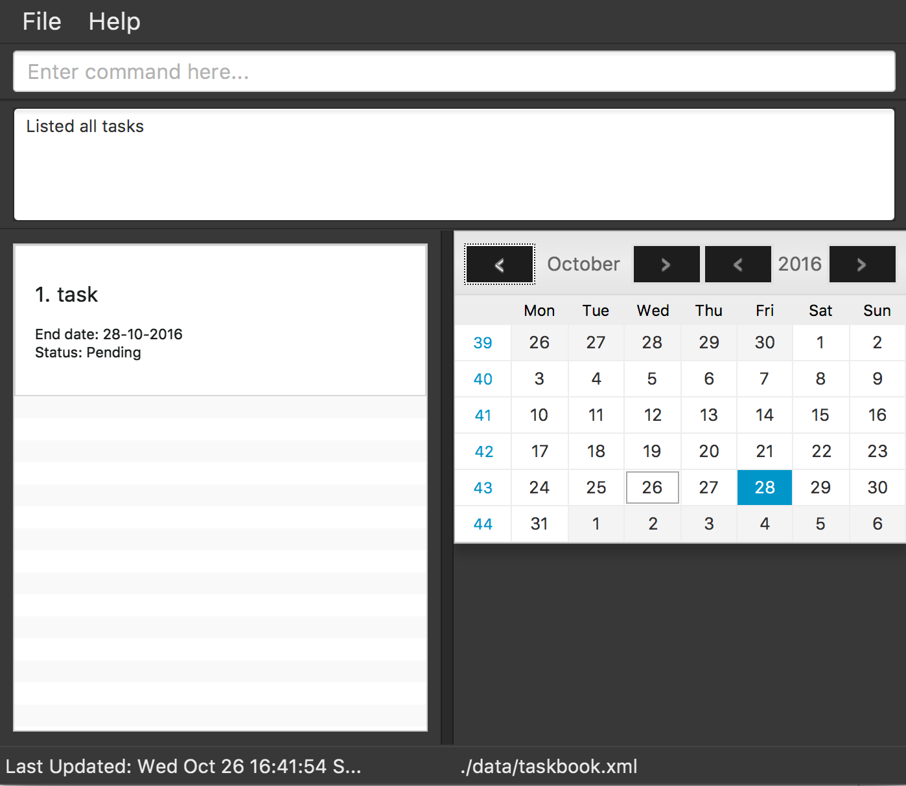

# User Guide

* [Quick Start](#quick-start)
* [Features](#features)
* [FAQ](#faq)
* [Command Summary](#command-summary)

## Quick Start

0. Ensure you have Java version `1.8.0_60` or later installed in your Computer. 
   > Having any Java 8 version is not enough.  
   This app will not work with earlier versions of Java 8.
   
1. Download the latest `supertasker.jar` from the [releases](../../../releases) tab.
2. Copy the file to the folder you want to use as the home folder for your Task Manager.
3. Double-click the file to start the app. The GUI should appear in a few seconds. 
   > 

4. Type the command in the command box and press <kbd>Enter</kbd> to execute it.  
   e.g. typing **`help`** and pressing <kbd>Enter</kbd> will open the help window. 
5. Some example commands you can try:
   * **`list`** : lists all tasks due today
   * **`add`**` follow up with Jack on sales report` : 
     adds a task named `follow up with Jack on sales report` to the Task Manager.
   * **`delete`**` 3` : deletes the 3rd task shown in the current list
   * **`exit`** : exits the app
6. Refer to the [Features](#features) section below for details of each command. 

## Features

> **Command Format**
> * Words in `UPPER_CASE` are the parameters.
> * Items in `[SQUARE_BRACKETS]` are optional.
> * The order of parameters is fixed.

<!-- @@author A0138704E -->
> **Task Structure** 

> There are 3 types of tasks.
> * To-do
> * Deadline
> * Event 

> Every task is either a to-do, deadline or event. It cannot be both or all 3 or none at all. 
> Refer to [Glossary](DeveloperGuide.md#appendix-d--glossary) for definitions of each type of task.
<!-- @@author A0153723J -->

#### Viewing help : `help`
Format: `help`

> Help is also shown if you enter an incorrect command e.g. `abcd`

<!-- @@author A0138704E -->
#### Adding a task : `add`
Adds a task to the task manager. 
Format: `add TASK_NAME [START_DATE [START_TIME]] [END_DATE [END_TIME]]` 

> `TASK_NAME` is required for adding any type of task. 
  To add a deadline, specify `END_DATE` and an optional `END_TIME`. 
  To add an event, specify `START_DATE` and `END_DATE` and optional `START_TIME` or `END_TIME`. 
  Dates have to be specified in the format `dd-mm-yyyy`, for e.g. `20-10-2016`. 
  Times have to be specified in 24-hour format, for e.g. `17:00` means `5 pm`. 
  The default time is 17:30 if time is not provided.

Examples: 
* `add follow up with Jack on sales report` 
  Adds a floating task named `follow up with Jack on sales report`.
* `add assignment 3 12-10-2016` 
  Adds a deadline named `assignment 3` due on 12th October 2016.
* `add assignment 3 12-10-2016 14:00` 
  Adds a deadline named `assignment 3` due on 12th October 2016, 2pm.
* `add project Highlight 01-10-2016 14-11-2016` 
  Adds an event named `project Highlight` starting on 1st October 2016 to 14th November 2016.
* `add meeting with John 01-10-2016 14:00 01-10-2016 16:00` 
  Adds an event named `meeting with John` on 1st October 2016, 2pm to 4pm.
  
#### Set task as complete : `complete`
Sets the specified task as complete. 
Format: `complete TASK_INDEX`

> Sets the task at the specified `TASK_INDEX` as complete. 
  The index refers to the index number shown in the most recent listing. 
  The index **must be a positive integer** 1, 2, 3, ...
  
Examples: 
* `list` 
  `complete 2` 
  Set the 2nd task as complete in the task manager.

#### Listing tasks : `list`
Shows a list of tasks in the task manager. 
Additional options include: `/a`, `/c`, `/p` 
Format: `list [OPTION]`

> The default option shows a list of tasks due today.
> * `/a` : Shows a list of all tasks in the task manager.
> * `/c` : Shows a list of completed tasks.
> * `/p` : Shows a list of pending tasks.

<!-- @@author A0153723J -->
#### Deleting a task : `delete`
Deletes the specified task from the task manager. 
Format: `delete TASK_INDEX`

> Deletes the task at the specified `TASK_INDEX`. 
  The index refers to the index number shown in the most recent listing. 
  The index **must be a positive integer** 1, 2, 3, ...

Examples: 
* `list` 
  `delete 2` 
  Deletes the 2nd task in the task manager.
* `find report`  
  `delete 1` 
  Deletes the 1st task in the results of the `find` command.
  
#### Finding all tasks containing any keyword in their name : `find`
Finds tasks whose names contain any of the given keywords. 
Format: `find KEYWORD [MORE_KEYWORDS]`

> * The search is not case sensitive. e.g `complete` will match `Complete`
> * The order of the keywords does not matter. e.g. `meeting John` will match `John meeting`
> * Partial words will be matched e.g. `meet` will match `meeting`
> * Tasks matching at least one keyword will be returned (i.e. `OR` search).
    e.g. `meeting` will match `meeting with John`

Examples: 
* `find Highlight` 
  Returns any tasks having names `Highlight` or `highlight`
* `find product highlight showcase` 
  Returns any task having names `product`, `highlight`, or `showcase`
* `find high` 
  Returns any tasks having names that contains the word `high`, for e.g. `Highlight` or `higher`
  
<!-- @@author A0138704E -->  
#### Editing a task : `edit`
Edits the specified task from the task manager. 
Format: `edit TASK_INDEX [TASK_NAME] [START_DATE [START_TIME]] [END_DATE [END_TIME]]`

> Edits the task at the specified `TASK_INDEX`. 
  The index refers to the index number shown in the most recent listing. 
  The index **must be a positive integer** 1, 2, 3, ... 
  Specified parameters will overwrite previous data. 
  To add a deadline to the specified task, specify `END_DATE` and an optional `END_TIME`. 
  To add an event to the specified task, specify `START_DATE` and `END_DATE` and optional `START_TIME` or `END_TIME`. 
  Dates have to be specified in the format `dd-mm-yyyy`, for e.g. `20-10-2016`. 
  Times have to be specified in 24-hour format, for e.g. `17:00` means `5 pm`. 
  The default time is 17:30 if time is not provided.

Examples: 
* `list` 
  `edit 2 23-10-2016` 
  Edit the 2nd task in the task manager into a deadline due on 23rd October 2016.
  
<!-- @@author A0153723J -->
#### Undoing the last command : `undo`
Undo the last command executed. 
Format: `undo`

> Able to undo up to the last 100 commands. 
  Only commands that changes data are included (`add`, `delete`, `clear`, `edit`, `complete`).
  
<!-- @@author A0138704E -->
#### Clearing tasks : `clear`
Clears tasks from the task manager. 
Additional options include: `/a` 
Format: `clear [OPTION]`

> The default option clears completed tasks from the task manager.
> * `/a` : clears all tasks from the task manager.

<!-- @@author A0153723J -->
#### Specifying data storage location : `store`
Specifies data storage location. 
Format: `store [FILE_LOCATION]`

> Stores data of the task manager at the specified `FILE_LOCATION`. 
  If `FILE_LOCATION` is not specified, a dialog box will appear and the user can browse for the storage location.

Examples: 
* `store C:\Users\Jim\Desktop\Work` 
  Specifies data storage location at 'C:\Users\Jim\Desktop\Work'.
  
* `store` 
  Displays a dialog box for user to browse for the storage location.
  
<!-- @@author A0138704E -->
#### Sorting tasks : `sort`
Sorts data in the task book by order end date then name. 
Format: `sort`

<!-- @@author A0153723J -->
#### Exiting the program : `exit`
Exits the program. 
Format: `exit`  

#### Saving the data 
Task book data are saved in the hard disk automatically after any command that changes the data. 
There is no need to save manually.

## FAQ
       
## Command Summary

Command | Format | Description 
----------- | ------------------------------- | :--------- 
Help | `help` | View help on command usage
Add | `add TASK_NAME [START_DATE [START_TIME]] [END_DATE [END_TIME]]` | Add a task
Complete | `complete TASK_INDEX` | Set task as complete
List | `list` | List tasks due today
Delete | `delete TASK_INDEX` | Delete a task
Find | `find KEYWORD [MORE_KEYWORDS]` | Find all tasks containing any keywords
Edit | `edit TASK_INDEX [TASK_NAME] [START_DATE [START_TIME]] [END_DATE [END_TIME]]` | Edit a task
Undo | `undo` | Undo last command
Clear | `clear` | Clear completed tasks
Store | `store [FILE_LOCATION]` | Specify storage location
Sort | `sort` | Sorts data in the task book by order end date then name
Exit | `exit` | Exit program
