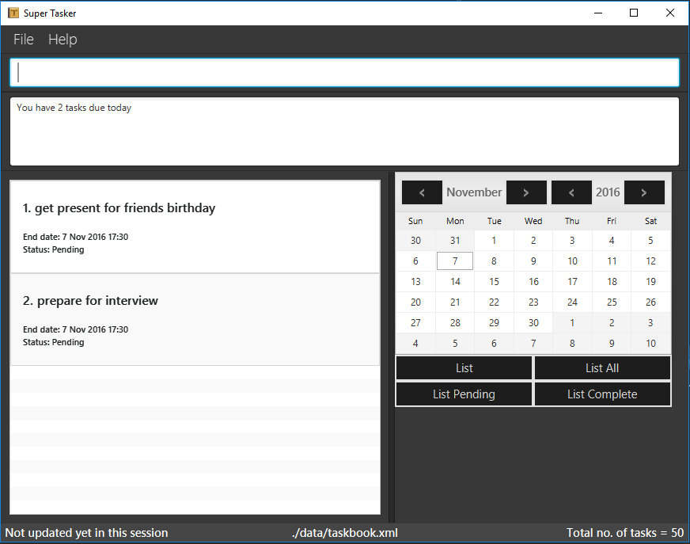
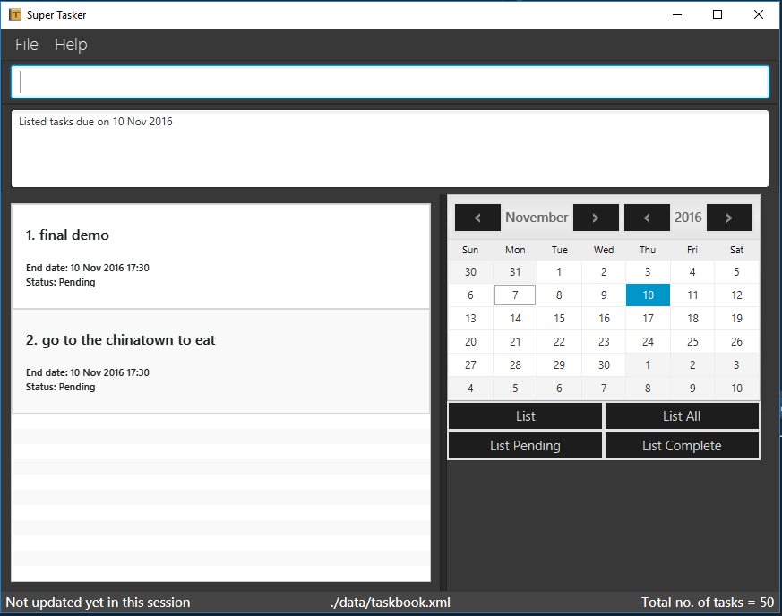
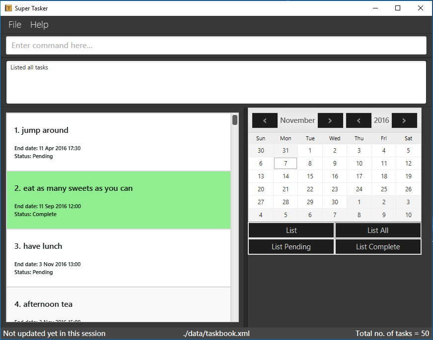
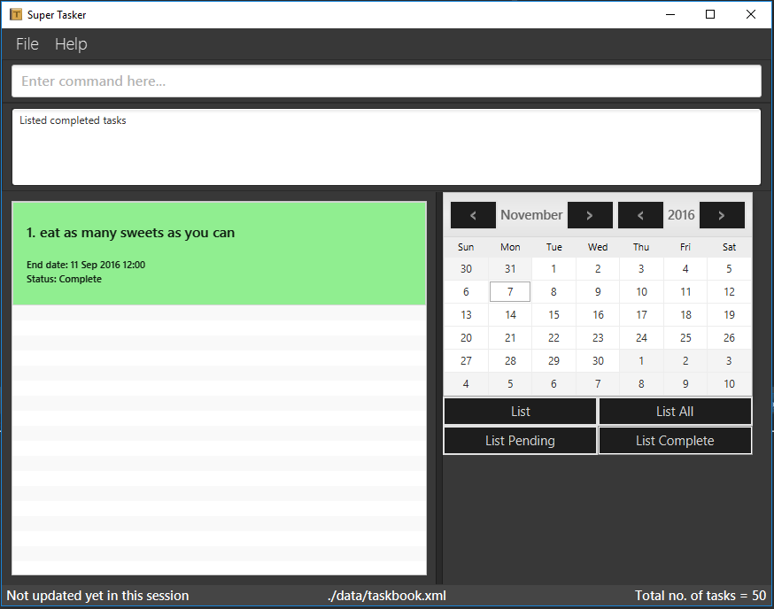

# User Guide

* [Quick Start](#quick-start)
* [Features](#features)
* [UI Features](#ui-features)
* [FAQ](#faq)
* [Command Summary](#command-summary)

## Quick Start

0. Ensure you have Java version `1.8.0_60` or later installed in your Computer. 
   > Having any Java 8 version is not enough.  
   This app will not work with earlier versions of Java 8.
   
1. Download the latest `supertasker.jar` from the [releases](../../../releases) tab.
2. Copy the file to the folder you want to use as the home folder for your Task Manager.
3. Double-click the file to start the app. The GUI should appear in a few seconds. 
   > 

4. Type the command in the command box and press <kbd>Enter</kbd> to execute it.  
   e.g. typing **`help`** and pressing <kbd>Enter</kbd> will open the help window. 
5. Some example commands you can try:
   * **`list`** : lists all tasks due today
   * **`add`**` follow up with Jack on sales report` : 
     adds a task named `follow up with Jack on sales report` to the Task Manager.
   * **`delete`**` 3` : deletes the 3rd task shown in the current list
   * **`exit`** : exits the app
6. Refer to the [Features](#features) section below for details of each command. 

## Features

> **Command Format**
> * Words in `UPPER_CASE` are the parameters.
> * Items in `[SQUARE_BRACKETS]` are optional.
> * The order of parameters is fixed.

<!-- @@author A0138704E -->

> **Task Structure** 

> There are 3 types of tasks.
> * To-do
> * Deadline
> * Event 

> Every task is either a to-do, deadline or event. It cannot be both or all 3 or none at all. 
> Refer to [Glossary](DeveloperGuide.md#appendix-d--glossary) for definitions of each type of task.

<!-- @@author A0153723J -->

#### Viewing help : `help`
Format: `help`

> Help is also shown if you enter an incorrect command e.g. `abcd`

<!-- @@author A0161247J -->

#### Adding a task : `add`
Adds a task to the task manager. 
Format: `add "TASK_NAME" [START_DATE [START_TIME]] [END_DATE [END_TIME]]` 

> `TASK_NAME` is required for adding any type of task. 
  To add a deadline, specify `END_DATE` and an optional `END_TIME`. 
  To add an event, specify `START_DATE` and `END_DATE` and optional `START_TIME` or `END_TIME`. 
  Dates can be in several formats from `Dec 3rd` to `December 20, 2016`. 
  Times can be in several formats, for e.g. `17:00` or `5pm`  

Examples: 
* `add "follow up with Jack on sales report"` 
  Adds a floating task named `follow up with Jack on sales report`.
* `add "assignment 3" October 12th` 
  Adds a deadline named `assignment 3` due on 12 Oct 2016.
* `add "assignment 3" Oct 12th at 2pm` 
  Adds a deadline named `assignment 3` due on 12 Oct 2016, 2pm.
* `add "project Highlight" Oct 1st to Nov 14th` 
  Adds an event named `project Highlight` starting on 1 Oct 2016 to 14 Nov 2016.
* `add "meeting with John" October 1st at 2pm to Oct 1st 16:00` 
  Adds an event named `meeting with John` on 1 Oct 2016, 2pm to 4pm.
  
<!-- @@author A0138704E -->

#### Set task as complete : `complete`
Sets the specified task as complete. 
Format: `complete TASK_INDEX`

> Sets the task at the specified `TASK_INDEX` as complete. 
  The index refers to the index number shown in the most recent listing. 
  The index **must be a positive integer** 1, 2, 3, ... 
  Completed tasks are hidden immediately after the command is executed.
  Completed tasks are highlighted in green.
  
Examples: 
* `list` 
  `complete 2` 
  Set the 2nd task as complete in the task manager.

#### Listing tasks : `list`
Shows a list of tasks in the task manager. 
Additional options include: `/a`, `/c`, `/p`, `DATE` 
Format: `list [OPTION]`

> The default option shows a list of tasks due today.
> * `/a` : Shows a list of all tasks in the task manager.
> * `/c` : Shows a list of completed tasks.
> * `/p` : Shows a list of pending tasks.
> * `DATE` : Shows a list of tasks due on the given date.

Example: 
* `list 8 nov 2016` 
  List tasks due on 8 Nov 2016.

<!-- @@author A0153723J -->

#### Deleting a task : `delete`
Deletes the specified task from the task manager. 
Format: `delete TASK_INDEX`

> Deletes the task at the specified `TASK_INDEX`. 
  The index refers to the index number shown in the most recent listing. 
  The index **must be a positive integer** 1, 2, 3, ...

Examples: 
* `list` 
  `delete 2` 
  Deletes the 2nd task in the task manager.
* `find report`  
  `delete 1` 
  Deletes the 1st task in the results of the `find` command.
  
#### Finding all tasks containing any keyword in their name : `find`
Finds tasks whose names contain any of the given keywords. 
Format: `find KEYWORD [MORE_KEYWORDS]`

> * The search is not case sensitive. e.g `complete` will match `Complete`
> * The order of the keywords does not matter. e.g. `meeting John` will match `John meeting`
> * Partial words will be matched e.g. `meet` will match `meeting`
> * Tasks matching at least one keyword will be returned (i.e. `OR` search).
    e.g. `meeting` will match `meeting with John`

Examples: 
* `find Highlight` 
  Returns any tasks having names `Highlight` or `highlight`
* `find product highlight showcase` 
  Returns any task having names `product`, `highlight`, or `showcase`
* `find high` 
  Returns any tasks having names that contains the word `high`, for e.g. `Highlight` or `higher`
  
<!-- @@author A0161247J -->

#### Editing a task : `edit`
Edits the specified task from the task manager. 
Format: `edit TASK_INDEX ["TASK_NAME"] [START_DATE [START_TIME]] [END_DATE [END_TIME]]`

> Edits the task at the specified `TASK_INDEX`. 
  The index refers to the index number shown in the most recent listing. 
  The index **must be a positive integer** 1, 2, 3, ... 
  Specified parameters will overwrite previous data. 
  To add a deadline to the specified task, specify `END_DATE` and an optional `END_TIME`. 
  To add an event to the specified task, specify `START_DATE` and `END_DATE` and optional `START_TIME` or `END_TIME`. 
  Dates can be in several formats from `Dec 3rd` to `December 20, 2016`. 
  Times can be in several formats, for e.g. `17:00` or `5pm`  

Examples: 
* `list` 
  `edit 2 "business meeting with new client"` 
  Edit the 2nd task in the task manager into a to-do task named `business meeting with new client`.
* `list` 
  `edit 2 23 Oct` 
  Edit the 2nd task in the task manager into a deadline due on 23 Oct 2016.
* `list` 
  `edit 2 23rd October 14:00` 
  Edit the 2nd task in the task manager into a deadline due on 23 Oct 2016, 2pm.
* `list` 
  `edit 2 23 Oct to 24th Oct` 
  Edit the 2nd task in the task manager into an event from 23 Oct 2016 to 24 Oct 2016.
* `list` 
  `edit 2 23 Oct 2pm 25th Oct 4pm` 
  Edit the 2nd task in the task manager into an event from 23 Oct 2016, 2pm to 25 Oct 2016, 4pm.
* `list` 
  `edit 2 3rd Oct 2pm to 3rd Oct 4pm` 
  Edit the 2nd task in the task manager into an event on 23 Oct 2016, 2pm to 4pm.
  
<!-- @@author A0153723J -->

#### Undoing previous commands : `undo`
Undo previous commands that were executed. 
Format: `undo`

> Able to undo up to the last 100 commands. 
  Only commands that changes data are included (`add`, `delete`, `clear`, `edit`, `complete`).
  
<!-- @@author A0138704E -->

#### Clearing tasks : `clear`
Clears tasks from the task manager. 
Additional options include: `/a` 
Format: `clear [OPTION]`

> The default option clears completed tasks from the task manager.
> * `/a` : clears all tasks from the task manager.

<!-- @@author A0153723J -->

#### Specifying data storage location : `store`
Specifies data storage location. 
Format: `store [FILE_LOCATION]`

> Stores data of the task manager at the specified `FILE_LOCATION`. 
  If `FILE_LOCATION` is not specified, a dialog box will appear and the user can browse for the storage location.

Examples: 
* `store C:\Users\Jim\Desktop\Work` 
  Specifies data storage location at 'C:\Users\Jim\Desktop\Work'.
  
* `store` 
  Displays a dialog box for user to browse for the storage location.
  
<!-- @@author A0138704E -->

#### Sorting tasks : `sort`
Sorts data in the task book by order end date then name. 
Format: `sort`

<!-- @@author A0153658W -->

#### Previous executed task : `[UP_ARROW_KEY]`
Pulls up user's previous executed task, similar to bash shell functionality. 
Format: `[UP_ARROW_KEY]`

#### Next executed task : `[DOWN_ARROW_KEY]`
Brings up user's next executed task, if there exists one.  
Format: `[DOWN_ARROW_KEY]`

<!-- @@author A0153723J -->

#### Exiting the program : `exit`
Exits the program. 
Format: `exit`  

#### Saving the data 
Task book data are saved in the hard disk automatically after any command that changes the data. 
There is no need to save manually.

## UI Features
#### List Tasks on a Specific Day using the calendar
Click on a day on the calender and the respective task for that day will appear.
 > 
 
#### List Today's Tasks
Click on the list button positioned below the calendar, and all of today's tasks will appear.
 > 
 
#### List all the tasks
Click on the list all button positioned below the calendar, and all tasks will appear.
 >  

#### List Completed Tasks
Click on the list completed button positioned below the calendar, and completed tasks will appear.
 > 
 
#### List Pending Tasks
Click on the list pending button positioned below the calendar, and pending tasks will appear.
 > 

<!-- @@author A0138704E -->

#### Status Bar Footer
There are 3 status indicators at the bottom of the application window, namely
* Sync status (on the left)
* Storage file location (in the middle)
* Total tasks (on the right)

Sync status shows the time of the last save done by the application. 
Storage file location shows you where the data file is located. 
Total tasks displays the number of tasks that exists in the application currently.

<!-- @@author A0153658W -->

## FAQ
**Q**: Can I run this on my Mac?  
**A**: Currently the application does function on Mac operating systems. However, because SuperTasker is intended for Windows machines, there are minor issues with the storage command. The storage file path standards for Windows differs from the file path on Mac, so you will manually need to update your storage path via the CLI instead of the GUI window explorer. 

**Q**: Can I open my tasks on another computer?  
**A**: To move your saved tasks to another computer, simply move the `taskbook.xml` file from your storage location to another new computer. From the new computer, run supertasker.jar and change the storage path to reference your copied `taskbook.xml`.

**Q**: Can I contribute to this project?  
**A**: Of course! This project is entirely open source and we welcome pull requests. Follow the process described [here](https://github.com/oss-generic/process)

<!-- @@author A0138704E -->

## Command Summary

| Command | Format | Description |
|----------|-------------------------------------------------------------------------------|--------------------------------------------------------------------------------------------------|
| Help | `help` | View help on command usage |
| Add | `add "TASK_NAME" [START_DATE [START_TIME]] [END_DATE [END_TIME]]` | Add a task |
|  | `add "write report"` | Adds a to-do |
|  | `add "assignment 3" October 12th` | Adds a deadline due on 12 Oct 2016 |
|  | `add "assignment 3" Oct 12th at 2pm` | Adds a deadline due on 12 Oct 2016, 2 pm |
|  | `add "consumer electronics fair" Nov 17th to Nov 20th` | Adds an event that starts from 17 Nov 2016 to 20 Nov 2016 |
|  | `add "meeting with John" Oct 1 2pm to 4pm` | Adds an event on 1 Oct 2016 from 2 to 4 pm |
| Complete | `complete TASK_INDEX` | Set task as complete |
|  | `list` `complete 1` | Completes the 1st task in the filtered task list |
| List | `list` | List tasks due today |
|  | `list /a` | List all tasks |
|  | `list /c` | List completed tasks |
|  | `list /p` | List pending tasks |
|  | `list 8 nov 2016` | List tasks due on 8 Nov 2016 |
| Delete | `delete TASK_INDEX` | Delete a task |
|  | `list` `delete 1` | Deletes the 1st task in the filtered task list |
| Find | `find KEYWORD [MORE_KEYWORDS]` | Find all tasks containing any keywords |
|  | `find Highlight` | Returns any tasks having names `Highlight` or `highlight` |
|  | `find product highlight showcase` | Returns any task having names `product`, `highlight`, or `showcase` |
|  | `find high` | Returns any tasks having names that contains the word `high`, for e.g. `Highlight` or `higher` |
| Edit | `edit TASK_INDEX ["TASK_NAME"] [START_DATE [START_TIME]] [END_DATE [END_TIME]]` | Edit a task |
|  | `list` `edit 2 "business meeting with new client"` | Edit the 2nd task in the task manager into a to-do task named `business meeting with new client` |
|  | `list` `edit 2 October 23rd` | Edit the 2nd task in the task manager into a deadline due on 23 Oct 2016 |
|  | `list` `edit 2 Oct 23rd at 2pm` | Edit the 2nd task in the task manager into a deadline due on 23 Oct 2016, 2pm |
|  | `list` `edit 2 Oct 23rd to Oct 24th` | Edit the 2nd task in the task manager into an event from 23 Oct 2016 to 24 Oct 2016 |
|  | `list` `edit 2 Oct 23 2pm to Oct 25 4pm` | Edit the 2nd task in the task manager into an event from 23 Oct 2016, 2pm to 25 Oct 2016, 4pm |
|  | `list` `edit 2 Oct 23 2pm to 4pm` | Edit the 2nd task in the task manager into an event on 23 Oct 2016, 2pm to 4pm |
| Undo | `undo` | Undo previous commands |
| Clear | `clear` | Clear completed tasks |
|  | `clear /a` | Clear all tasks |
| Store | `store [FILE_LOCATION]` | Specify data storage location |
|  | `store C:\Users\Jim\Desktop\Work` | Specifies data storage location at folder `C:\Users\Jim\Desktop\Work` |
|  | `store` | Displays a dialog box for user to browse for the storage location |
| Sort | `sort` | Sorts data by order end date then name |
| Exit | `exit` | Exit program |
